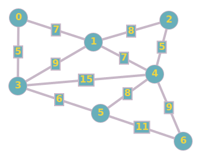
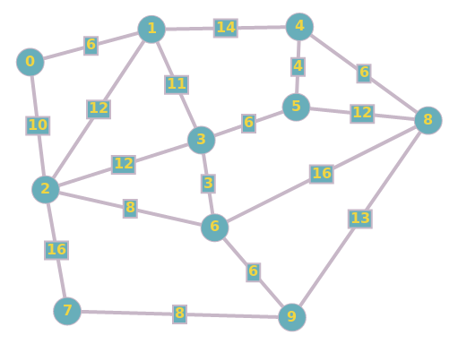

# Implementação árvores geradoras [:link:](https://github.com/ruanpato/gen254/tree/master/arvore_geradora) #

Este trabalho compõe parte da primeira Nota Parcial (NP2) do componente curricular obrigatório Grafos cursado no segundo semestre de 2019 na Universidade Federal da Fronteira Sul, Campus Chapecó.

## Sumário ##

- [Implementação árvores geradoras :link:](#implementa%c3%a7%c3%a3o-%c3%a1rvores-geradoras-link)
  - [Sumário](#sum%c3%a1rio)
  - [Descrição](#descri%c3%a7%c3%a3o)
  - [Como usar](#como-usar)
    - [Testes automatizados](#testes-automatizados)
  - [Ferramentas utilizadas](#ferramentas-utilizadas)
  - [Autores](#autores)

## Descrição ##

Dada uma matriz de incidência ou adjacência de um grafo não-orientado, implementar:  

- Montagem da árvore geradora com Algoritmo de Prim.
- Montagem da árvore geradora com Algoritmo de Kruskal.  

Uma função deve ser implementada para cada tipo de busca (2 funções no total). Exemplo:  
  
   arvore_prim(matriz, inicio) :heavy_check_mark:  
   arvore_kruskal(matriz) :heavy_check_mark:
  
**Retorno:** A função deve executar a montagem da árvore independente do tipo de matriz fornecida como entrada.  

O trabalho pode ser escrito em ​ python​ ou ​ C/C++​ .  

O código deve ser escrito em um arquivo apenas. Este arquivo deve ser submetido via
moodle até ​**22/11/2019​**.  

## Como usar ##

Em ambiente linux via terminal estando no diretório do arquivo fonte para compilar, executar e testar manualmente basta rodar o seguinte comando:

```bash
g++ minimun_spanning_tree.cpp -o minimun_spanning_tree && ./minimun_spanning_tree
```

### Testes automatizados ###

Será inserido o grafo da imagem através de matriz de adjacências ou incidências.  

1. Será exibido os vértices e os quais esses estão conectados.
2. Serão exibidas as arestas do grafo.
3. Algoritmo kruskal será executado e exibirá as arestas adicionadas.
4. Algortimo prim será executado n vezes onde o argumento de vértice inicial será setado como 0 e irá até n-1, sendo n a quantidade vértices.
5. A execução será encerrada.

**Caso de teste 0:**



```bash
g++ minimun_spanning_tree.cpp -o minimun_spanning_tree && ./minimun_spanning_tree < case_0_adjacency
g++ minimun_spanning_tree.cpp -o minimun_spanning_tree && ./minimun_spanning_tree < case_0_incidence
```

**Caso de teste 1:**



```bash
g++ minimun_spanning_tree.cpp -o minimun_spanning_tree && ./minimun_spanning_tree < case_1_adjacency
g++ minimun_spanning_tree.cpp -o minimun_spanning_tree && ./minimun_spanning_tree < case_1_incidence
```

## Ferramentas utilizadas ##

- [GNU-GCC](https://gcc.gnu.org/) - GNU-GCC Compiler collection.
- [Graph Online](https://graphonline.ru/en/) - Graph Online is online project aimed at creation and easy visualization of graph.

## Autores ##

- **[Ruan Natan Guerra Pato](https://github.com/ruanpato)** - Desenvolvimento do trabalho e mantenedor do repositório.
- **PhD. Giancarlo Dondoni Salton** - *Professor*
